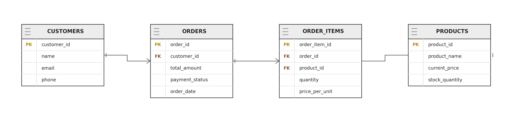

# Shwapno Clone: AI-Driven Grocery E-Commerce Platform

A modernized, high-performance web and mobile clone of Bangladesh's leading grocery retail platform, Shwapno. Built with a unified React frontend, Express.js serverless backend, and local relational SQL architecture, this application introduces cutting-edge AI utilities for consumers and data-driven market analytics for merchants.

---

##  Database Architecture & ER Diagram

The system relies on a lean, 4-table relational database model designed to guarantee historical accounting integrity (capturing the exact unit prices at checkout regardless of future updates) and feed the backend machine learning engines.

### ER Diagram
<!-- Replace the path below with your image file path once you add it -->

### Schema Overview
*   **CUSTOMERS:** Manages user identity, contact points, and authentication profiles.
*   **PRODUCTS:** Tracks inventory catalogs, live pricing matrices, and available stock volumes.
*   **ORDERS:** Captures historical transaction headers, global order tracking timestamps, and checkout totals.
*   **ORDER_ITEMS:** The core analytical ledger tracking exactly which customer bought what item, at what volume, and at what specific unit price at the moment of payment settlement.

---

##  Backend API Layer (Express.js)

The backend handles the serverless application logic, REST endpoints, and the primary algorithmic computations for the AI systems.

### Core Features
*   **Data Footprint:** Utilizes a local SQLite file for low-overhead, lightning-fast development iterations, easily shiftable to cloud serverless SQL (PostgreSQL/Neon) for complete persistent data write-operations in production.
*   **Semantic Search API:** Translates messy user prose into vector space, running search queries through a natural language processing layer to identify exact product matches.
*   **Market Basket Analysis Engine:** Runs association rule models (Apriori/FP-Growth algorithms) directly over the transaction history to uncover product-to-product correlations for merchants.

### API Architecture Setup
*   Deployed as containerized nodes or handled smoothly as distributed serverless functions via platforms like Vercel/Netlify.
*   Implements secure environment variables configurations and Strict Cross-Origin Resource Sharing (CORS) rule routing to bridge front-end requests.

---

##  Frontend & Mobile Presentation Layer (React.js)

The user interface delivers a major visual upgrade over the original Shwapno architecture, eliminating heavy page nesting in favor of a clean, responsive layout optimized for web browsers and mobile engines.

### Core Features
*   **Intelligent Unified Search Bar:** Supports both text-based semantic typing and reverse image lookups, allowing users to upload product images to query catalog listings instantly.
*   **Merchant Analytics Dashboard:** Visualized controls showing store managers the exact purchase behaviors, sales margins, and real-time metrics tracking whether cross-promoting correlated products side-by-side yields an active sales increase.
*   **Android App Adaptation:** Packaged as a compiled native Android Application (`.apk`) using native web-view wrappers (Capacitor/Ionic), maintaining shared codebase synchronization with the web layout.

---

##  Advanced AI & Machine Learning Implementations

The core focus of this application is leveraging Artificial Intelligence to optimize the consumer shopping experience and maximize merchant sales velocity. The following AI pipelines are integrated directly into the system:

### 1. Natural Language Semantic Search (The Search Bar)
*   **The User Problem:** Traditional SQL text matching (`LIKE %milk%`) crashes on typos, language mixing, or abstract customer desires (e.g., searching for *"something quick for a healthy breakfast"* yields 0 results).
*   **The AI Solution:** The search bar utilizes a dense vector embedding pipeline. When a user enters text, the backend converts the raw string into a high-dimensional vector using a lightweight, multilingual embedding model (such as `all-MiniLM-L6-v2`). 
*   **The Mechanism:** The product database stores pre-computed vector embeddings for item descriptions. The system runs a high-performance **Cosine Similarity** computation comparing the user's query vector against the product catalog vectors, serving highly relevant products matching the *intent*, not just the text.

### 2. Reverse Image Lookup (Visual Search)
*   **The User Problem:** A customer sees a product in their pantry or fridge but doesn't know the exact name or brand to type into the grocery app.
*   **The AI Solution:** Users can snap a photo via their Android device or upload an image file directly into the web search bar. 
*   **The Mechanism:** The backend routes the image payload through a pre-trained Vision Transformer (ViT) or a Convolutional Neural Network (CNN) like ResNet to extract spatial feature maps. These visual features are compressed into an image vector and checked against the catalog's pre-mapped image vectors to surface matching inventory items instantly.

### 3. Merchant Dashboard: Market Basket Analysis (Association Rules)
*   **The Merchant Problem:** Grocers struggle to understand which items drive the sales of other items, making digital storefront product placement random.
*   **The ML Solution:** The owner's dashboard runs an unsupervised data-mining model utilizing the **Apriori / FP-Growth algorithm** directly over historical data.
*   **The Mechanism:** By parsing groupings within the `ORDER_ITEMS` table sharing identical `order_id` references, the engine continuously calculates two primary metrics:
    *   **Support:** How frequently a combination of products appears out of total transactions.
    *   **Confidence:** The conditional probability that a customer buys Product B given that they have already added Product A to their cart ($A \rightarrow B$).
*   **A/B Testing Impact Matrix:** The dashboard provides a visual analytical interface where merchants can isolate highly correlated items (e.g., Bread and Butter), track their placement parameters (e.g., "Placed Side-by-Side on Home Banner"), and monitor real-time sales velocity to confirm if cross-promotion drives an active conversion lift.
